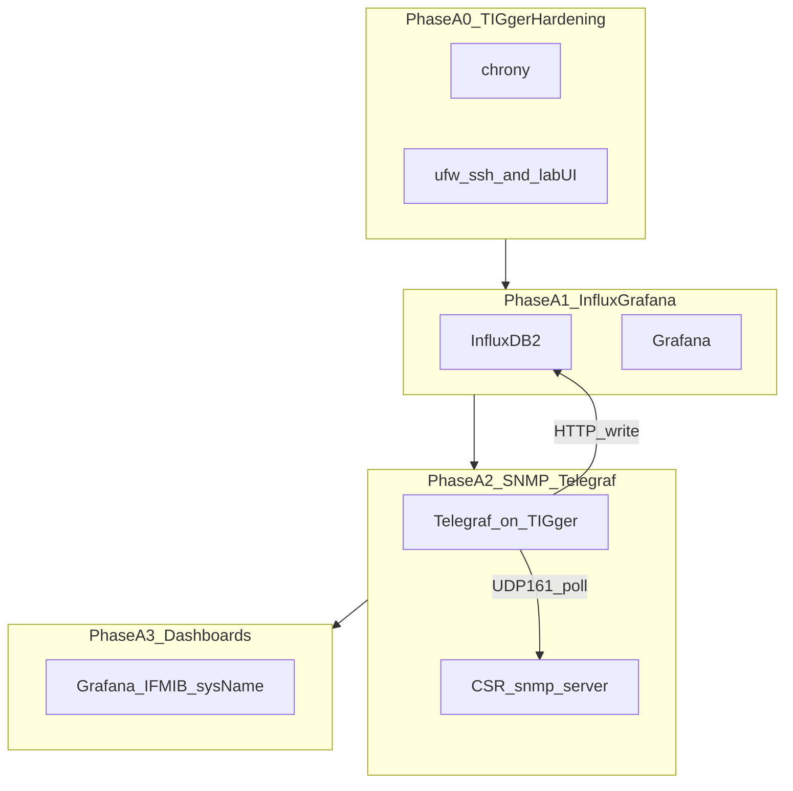

# Design: TIG stack on host TIGger (SNMP Phase A; gNMI Phase B deferred)

**Status:** Approved plan — **A0**/**A1**/**A1-smoke** in **`infra/tig/`**; **A2** **`csr_snmp.yml`** + **`install_telegraf_snmp_csr.sh`** **lab-validated May 2026**; **A3** starter Grafana dashboard **`infra/tig/grafana/dashboards/csr-snmp-overview.json`** (import + **Bucket** variable; see **`infra/tig/grafana/README.md`**). Ops hub: **`docs/monitoring/tig/`**.
**Audience:** Operators + coding agents picking up after a fresh chat  

**Mirrors Cursor plan:** SNMP-first for **CSR IOS-XE 16.05.01b**; **gNMI / MDT only after IOS upgrade**.

---

## Locked assumptions

| Item | Choice |
| --- | --- |
| **TIG** | **Telegraf + InfluxDB + Grafana** |
| **Collector host** | **TIGger** — **its own** Ubuntu VM (**not** the **`lab_syslog_collector`** / AnsibleUbuntu host on **`10.0.0.0/24`**). Example sizing: 8 vCPU, 8+ GB RAM, 100 GB SSD. **Lab mgmt IPv4:** **`10.0.0.24`**. |
| **Repo home** | **basic_netai** |
| **CSR reality** | **IOS-XE 16.05.01b** — treat **SNMP** as the practical metrics path; **gNMI** deferred |
| **Syslog today** | Stays **[`docs/monitoring/syslog.md`](../monitoring/syslog.md)** (CSR → Ubuntu **`all.log`**), separate pipeline from TIG metrics until you deliberately bridge |

---

## Goals

| Goal | How |
| --- | --- |
| Learn incrementally | Phased checkpoints + **journals** with prompt excerpt + commands ([`docs/journal/README.md`](../journal/README.md)) |
| Metrics from CSR **now** | **SNMPv3 (preferred)** or **v2c RO** + **ACL to TIGger only**; **Telegraf** `[[inputs.snmp]]` on TIGger → **Influx** |
| **gNMI later** | **Phase B**: checklist + docs **only** until CSR runs **≥ ~16.11 / 17.x** ([Cisco docs / feature navigator](https://cfnng.cisco.com/)) |

---

## Repo layout (SNMP path)

| Path | Purpose |
| --- | --- |
| **`docs/monitoring/tig/README.md`** | Operational hub — ports, phase checklist, SNMP vs gNMI table |
| **`docs/monitoring/tig/snmp-ios-xe.md`** | **`snmp-server`** patterns for CSR 16.05 |
| **`docs/monitoring/tig/gnmi-roadmap.md`** | Phase B gate (defer gNMI until IOS upgrade) |
| **`infra/tig/`** | Install scripts + **`dotenv.example`** (**no secrets in git**) + SNMP fragment **`render_telegraf_snmp_fragment.py`** |
| **`infra/tig/grafana/`** | Phase A3 — **`dashboards/csr-snmp-overview.json`** (Flux, **`csr_snmp`**) |
| **`infra/ansible/playbooks/csr_snmp.yml`** | Prelude + **numbered standard ACL** + **`snmp-server`** RO (**`CSR_SNMP_RO_COMMUNITY`**); **`verify_csr_snmp.yml`** |

---

## Phase A — SNMP pathway (execute in order)

| Step | Outcome |
| --- | --- |
| **A0** | **`chrony`**, **`ufw`** — SSH allowed; Grafana **3000** / Influx **8086** restricted to lab or tunnel-only |
| **A1** | **InfluxDB 2** org + bucket; API token (**never committed**); **Grafana** install |
| **A2** | **CSR:** `snmp-server` + ACL permitting **only TIGger** toward **UDP 161**. **TIGger:** **`snmpwalk`** proof, then **Telegraf** `outputs.influxdb_v2` + `[[inputs.snmp]]` to CSR mgmt IPs from **[`infra/ansible/inventory/hosts.yml`](../../infra/ansible/inventory/hosts.yml)** |
| **A3** | Grafana import **CSR SNMP** dashboard (**sysUpTime** + latest table; **IF-MIB** interfaces optional later) |
| **A4 (optional)** | **inputs.ping**; syslog ingest bridge — separate |

**Safety:** read-only SNMP only; **[`docs/agent-ops/safety.md`](../agent-ops/safety.md)**.

---

## Phase B — gNMI / model-driven telemetry (deferred)

**Gate:** CSR **IOS-XE ≥ ~16.11** or **17.x**. **Do not schedule implementation** while lab remains **16.05.01b**.

| Step | Outcome |
| --- | --- |
| **B0** | Choose target image; backup `running-config`; upgrade **one** lab CSR |
| **B1** | Enable telemetry / **gNMI** or **gRPC dial-out** per **that release’s** programmability guide |
| **B2** | **Telegraf `inputs.gnmi`** vs router **dial-out** — pick and document |
| **B3** | Grafana dashboards for subscription health |

Before any B execution: **`gnmi-roadmap.md`** checklist only.

---

## Out of scope (initial tranche)

Influx HA, full Ansible provisioning of TIGger (optional later), Grafana Git-sync.

---

## Execution prerequisites

- **TIGger** reachable from your workstation (**SSH key** already deployed per your notes).
- **L3**: TIGger → each **`ansible_host`** on CSRs.
- Firewall: **CSR ACL** allows **SNMP** sourcing **only TIGger** toward **UDP 161**.

---

## New-agent pickup line

`*Read docs/AGENTS.md, docs/AGENT_ONBOARDING.md, and docs/design/2026-05-10-tigger-TIG-snmp-phased.md — implement Phase A0 documentation + infra/tig scaffolding per checklist.*`
